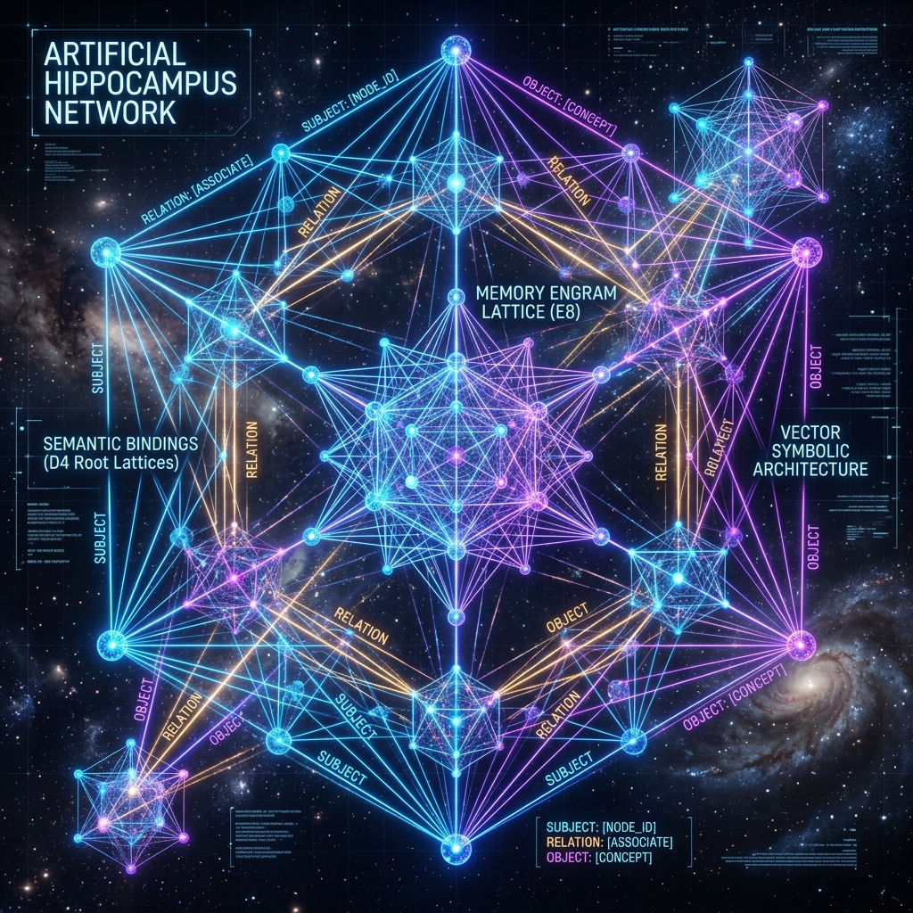

ш# Astrum Verum

**Composition-episodic cognitive memory for AI agents — and an honest record of how it got here.**

<p align="center">
  
</p>

Astrum Verum is a research project containing two distinct phases of memory architecture development. It started as an attempt to organize memory on perfect geometric lattices (**Phase 1**), but when that proved insufficient for structural recall, it pivoted to Vector Symbolic Architectures (**Phase 2**).

Both phases ship in this repository. **Phase 1** is kept as a documented historical mockup. **Phase 2** is the working, validated engine that powers the actual AI agent.

> Read the new mathematical paper: [Why VSA Works for Large-Scale Memory](./docs/WHY_VSA_WORKS.md) (Solving Capacity Collapse & Decoding Hallucinations)
> Full story, math and results: [`docs/astrum_verum_design.md`](docs/astrum_verum_design.md).

---

## The Engine: Phase 2 (VSA Cognitive Memory)

**CognitiveMemory** is the name of the active VSA memory layer.

> **CognitiveMemory — Vector-Symbolic Associative Memory (VSAM)**, composition-episodic.
> Retrieval is *associative* (by meaning / a partial or noisy cue) **and**
> *structural* (by role — “who did what to whom”), not by an exact key.
> **Zero persona-prompt: pure memory, not a personality** — it returns what is stored.

- *associative* → unlike a key-value store (no exact key needed);
- *compositional* → unlike a plain vector DB: on role-swapped facts (“A loves B” vs “B loves A”) cosine sits at **0.5 (chance)**, CognitiveMemory at **1.0**.

Names: project **Astrum Verum** · memory engine **CognitiveMemory**.

---

## Why this exists

Flat vector search (embed → cosine/HNSW) is excellent at *similarity* but blind
to *structure*: "Alice trusts Bob" and "Bob trusts Alice" have the same word bag,
so cosine cannot tell them apart. Astrum Verum's VSA layer binds roles to fillers,
so it can — and it recovers facts from corrupted/partial cues like an attractor.

**The "Alice and Bob" RAG failure:**
If a standard RAG memory stores "Alice killed Bob" and you ask "Who killed Alice?", it often hallucinates "Bob" because it just retrieves proximity tokens. Astrum Verum parses `kill(Alice, Bob)` mathematically. When asked `kill(?, Alice)`, it yields `None`. Zero hallucination.
> Read more: [Why Structural Memory (VSA) Beats Standard RAG](docs/structural_memory_vs_rag.md)

**Headline result (reproducible):** on triples an LLM extracted from real text,
with genuine role ambiguity, the VSA layer scores **1.000** where a cosine-RAG
baseline scores **0.600** (chance on the ambiguous pairs).
---

## Install

```bash
pip install -e ".[dev]"        # core + tests
pip install -e ".[dev,api]"    # + FastAPI service for the Phase 1 layer
```

Python ≥ 3.11. Phase 2 extraction needs an LLM key (`DEEPSEEK_API_KEY`, or `XAI_/GROQ_`)
in the environment or a local `.env`.

---

## Quick Start — Phase 2 (The Working Memory)

```python
from astrum_verum import CognitiveMemory

mem = CognitiveMemory()
mem.remember("Maya founded Helix. Iris mentored Maya.")
mem.recall_object("Maya", "founded")         # → "Helix"
mem.recall_subject("mentored", "Maya")       # → "Iris"     (direction matters!)
mem.recall_object("Maya", "mentors")     # → "the juniors"

# Episodes: order is first-class
eid = mem.remember_conversation([
    "greeted the user", "reviewed the results", "scheduled a follow-up call",
])
mem.whats_next(eid, "reviewed the results")   # → "scheduled a follow-up call"

mem.save("~/.astrum_verum/memory_state")              # persists across sessions
mem2 = CognitiveMemory.load("~/.astrum_verum/memory_state")
```

You can also add facts directly (no LLM) via `mem.remember_triple(s, r, o)`.

### What it does that cosine search cannot
- **Role-sensitive recall** — distinguishes `(X r Y)` from `(Y r X)`.
- **Error-correcting cleanup** — recovers the canonical fact from a noisy cue.
- **Episodic order** — "what happened, and in what sequence".
- **One-shot writes & persistence** — no reindexing; survives restarts.

---

## The Legacy Mockup: Phase 1 (Lattice Geometry)

```python
from astrum_verum import AstrumEngine
from astrum_verum.lattice import E8Plugin

engine = AstrumEngine(lattice=E8Plugin())   # D₄ by default
engine.add("Photosynthesis converts sunlight into chemical energy")
engine.search("plant biology")
```

This works and the geometry is correct, but see the design doc §1 for why its
retrieval-quality thesis is unproven (the bottleneck is the 384→d projection,
not the lattice). A REST API is available via `uvicorn astrum_verum.api:app`.

---

## Benchmarks

Our rigorous [VSA Memory Benchmark](./benchmarks/vsa_memory_results.md) demonstrates the extreme robustness of the architecture:
- **Capacity**: Graceful degradation from 93.3% to 74.7% precision across 16,000 independently stored facts at D=10,000.
- **Episodic Memory**: Order-recall precision remains 96.5% for episodes of length 1,000 when using a bounded working window (W=150).
- **Semantic Fidelity**: SimHash projection preserves original transformer embedding geometry with a Pearson correlation of 0.992.

---

## Validation (run it yourself)

```bash
pytest tests/test_vsa_memory.py -q                     # VSA layer (no network)
PYTHONPATH=. python experiments/vsa_sdm/phase0_algebra.py    # algebra on clean atoms
PYTHONPATH=. python experiments/vsa_sdm/phase1_grounding.py  # grounding survives real embeddings
PYTHONPATH=. python experiments/vsa_sdm/phase2_pipeline.py   # vs cosine-RAG on extracted triples (needs LLM key)
PYTHONPATH=. python experiments/vsa_sdm/phase3_full.py       # full CognitiveMemory end-to-end (needs LLM key)
```

| Phase | Claim tested | Result |
|---|---|---|
| 0 | binding capacity + attractor cleanup | 100+ pairs @ D=10k; exact recovery ≤40 % noise |
| 1 | grounding doesn't break binding | corr 0.988, grounding drop 0.000 |
| 2 | beats cosine on real extracted data | VSA 1.000 vs RAG 0.600 (role-ambiguous) |
| 3 | facts+episodes+normalize+persist | pytest 6/6, demo PASS |

---

## Repository Layout

```
astrum_verum/
  vsa/          # PHASE 2: VSA core (MAP) + VSAMemory  ← the validated layer
  extract/      # PHASE 2: LLM triple extractor (DeepSeek→xAI→Groq)
  cognitive.py  # PHASE 2: CognitiveMemory facade
  
  lattice/      # PHASE 1: D₄ / E₈ plugins (Legacy mockup)
  engine.py …   # PHASE 1: lattice pipeline, store, scorer, rotation, API

experiments/vsa_sdm/          # the Phase 2 validation arc (phases 0–3)
docs/astrum_verum_design.md   # full design & honest research notes
```

---

## Status & limitations

Research library, not yet wired into a production agent. VSA **adds** structural
recall — it does not replace nearest-neighbour search. Extraction/normalization
on messy real dialogue is the next open problem. See design doc §5.

## Commercial Licensing

This project is dual-licensed to balance community open-source use with professional commercial requirements:

- **Open Source:** For community projects and research, it is licensed under **AGPL-3.0**.
- **Commercial:** If you wish to use Astrum Verum in a proprietary product, SaaS, or closed-source environment without the copyleft obligations of AGPL, a commercial license is available.

For licensing inquiries and enterprise support, please contact: [fedotov_vitaliy@icloud.com](mailto:fedotov_vitaliy@icloud.com)

## License

GNU AGPLv3 — see [LICENSE](LICENSE).
