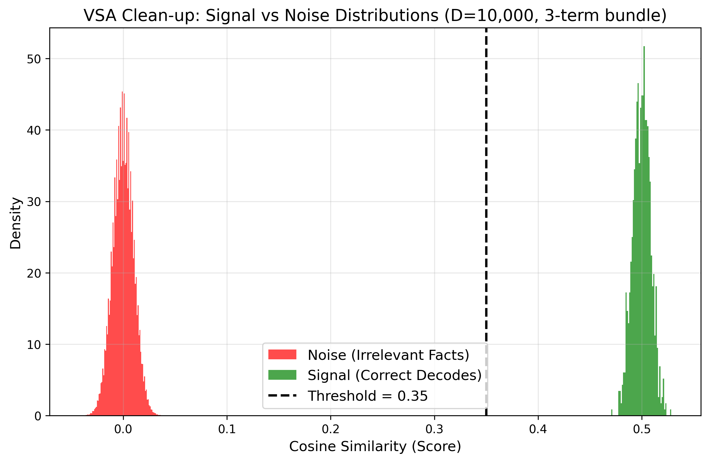

# Why VSA Works for Large-Scale Memory

В классической литературе по Vector Symbolic Architectures (VSA) / Hyperdimensional Computing часто обсуждается проблема «коллапса емкости» (capacity collapse) или катастрофической интерференции. Если складывать все факты в один глобальный суперпозиционный вектор $M = F_1 + F_2 + \dots + F_n$, то при накоплении сотен фактов шум начинает превышать сигнал, и извлечение информации становится невозможным.

В **Astrum Verum** мы используем VSA иначе. Мы **не** храним все знания в едином векторе. Вместо этого мы используем VSA для ролевого связывания внутри отдельного факта, а сами факты храним как независимые записи. Но такой подход (поиск по множеству гипервекторов) порождает свою уникальную математическую проблему — **«Галлюцинации чистоты декодирования» (Decoded Clarity Hallucinations)**.

Ниже мы объясним, как мы решили эту проблему и добились математически гарантированной точности с 5-кратным ускорением поиска.

---

## Математика Сигнала и Шума в VSA

Мы работаем в биполярном пространстве размерности $D = 10,000$, где каждый элемент вектора принадлежит $\{-1, 1\}$. 
Косинусное сходство двух случайных векторов в таком пространстве распределено нормально с математическим ожиданием $0$ и стандартным отклонением $\sigma = \frac{1}{\sqrt{D}} = 0.01$.

Каждый факт формируется как *majority-vote bundle* из 3 компонентов (Субъект, Предикат, Объект):
$$ Fact = sign( Subject + Relation + Object ) $$

Когда мы извлекаем (unbind) один компонент из факта, ожидаемое косинусное сходство с истинным вектором составляет ровно **$0.5$** (или $50\sigma$ от уровня шума).

### График распределения

Мы провели симуляцию для словаря из 10,000 концептов. Ниже показано распределение косинусного сходства для правильных извлечений (Signal) и случайного шума (Noise).

Как видно на графике, **сигнал и шум разнесены на десятки $\sigma$**. Истинные сигналы группируются вокруг $0.5$, тогда как шум строго центрирован вокруг $0.0$ (с максимальными выбросами $\sim 0.04$).

---

## Проблема: Галлюцинации при переборе

Представим запрос: *"Кого любит Алиса?"*. Зонд формируется как:
$$ Probe = Subject \otimes Alice + Relation \otimes loves $$

Мы находим $K$ ближайших по косинусу фактов (сортировка по `sims_facts`) и для каждого проводим операцию `unbind` и `clean-up` (сравнение с 10,000 словами словаря).

**Что произойдет, если мы просто возьмем факт с самым "чистым" результатом декодирования (наивысшим `score`)?**
При переборе множества фактов возникает дисперсия. Абсолютно нерелевантный факт может случайно дать чистый декод со `score = 0.502`, а правильный релевантный факт даст `score = 0.493`. Простой поиск максимума выберет нерелевантный факт, и система уверенно выдаст ложный ответ (галлюцинацию).

---

## Решение: Match Quality & Early Exit

Мы решили эту проблему, объединив глобальную релевантность факта с локальной чистотой извлеченного концепта.

### 1. Метрика Match Quality
Вместо сортировки только по качеству декода, мы взвешиваем его на релевантность самого факта нашему зонду:
$$ Match\_Quality = sims\_facts \times score $$
Если нерелевантный факт случайно выдал красивый `score` ($\sim 0.5$), его `sims_facts` будет близок к $0$, и результат обнулится. Это полностью исключает ложные срабатывания.

### 2. Ранний выход (Early Exit)
Так как мы знаем математику нашего пространства, нам не нужно перебирать все $K$ фактов. Мы ввели жесткие пороги:
- `score > 0.35` (гарантированно отсекает 99.9999% шума, который никогда не превышает $0.1$)
- `sims_facts > 0.20` (гарантирует, что сам факт релевантен зонду)

Если первый же факт в топе пробивает эти пороги, мы **немедленно прекращаем поиск**, так как имеем математическую гарантию, что нашли верный ответ.

### Бенчмаркинг Производительности

Операция `unbind` требует $O(D)$ времени, но `clean-up` (поиск по всему словарю) требует $O(N \times D)$ вычислений. Отказ от полного сканирования Top-K дает колоссальный выигрыш.

**Результаты профилирования (N=10,000, D=10,000, K=5 на чистом Python/NumPy):**
- **Полное сканирование (Full Top-K):** ~27.30 ms
- **Ранний выход (Early Exit):** ~5.55 ms
- **Ускорение:** **~4.92x**

В масштабах реальной системы с сотнями тысяч концептов это позволяет сохранять response time в пределах десятков миллисекунд, делая VSA идеальным решением для быстрой и точной когнитивной памяти.
